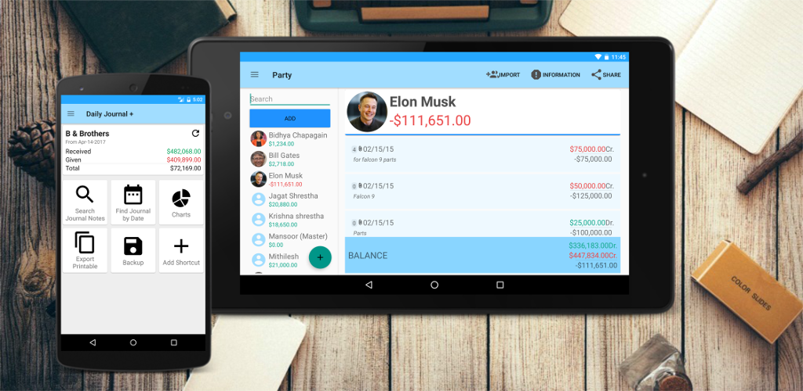
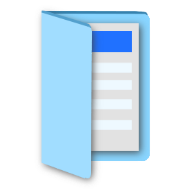

# Daily Journal Plus
Link <a>https://dailyjournal.page.link/6SuK</a>
  

Mission Statement: To provide small businesses (that cannot afford accounting software) a means to manage their transactions in the easiest way possible. 

<table>
  <tr>
    <th colspan="2">App Icons</th>
  </tr>
  <tr>
    <td></td>
	<td></td>
  </tr>
</table>

Description: This is an accounting app that allows user (usually with minimum accounting knowledge) to record daily Journal transactions in the easiest way possible. It has following features,

- Journal Entry (with Speech Recognition support)
- Automatic Ledger Entry
- Attachments 
- Backups
    -  Google Drive
    -  SD card / local storage
    -  Choose interval for automatic backup
- Chose Format,
    - Currency
    - Date 
    - Ledger View
   - Word Choice
        - Journal / Transaction
        - Party / Account
        - Dr. / Give
- Import Party from your Contact List
- Export Ledgers in text format, PDF format, CSV format
- Share Ledger/Statement via Email, Bluetooth...

###Requirements

- Android 4.0+

### How to Install

Stable release is available from the Google Play Store Marketplace.

https://play.google.com/store/apps/details?id=com.ndhunju.dailyjournalplus  

### Usage

Video => https://www.youtube.com/playlist?list=PL71y4IDEO0dPBdxEbF4nt-YTe5JyLF7-M

### Uninstall

On your phone under Settings -> Applications -> Manage applications-> Daily Journal -> Uninstall
