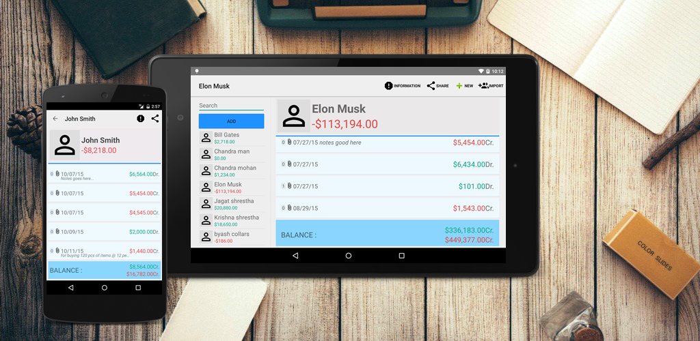
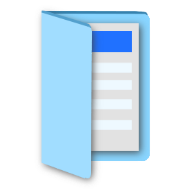

# Daily Journal
Link <a>https://goo.gl/vPGa66</a>
  

Mission Statement: To provide small businesses (that cannot afford accounting software) a means to manage their transactions in the easiest way possible. 

<table>
  <tr>
    <th colspan="2">App Icons</th>
  </tr>
  <tr>
    <td></td>
	<td></td>
  </tr>
</table>

Description: This is an accounting app that allows user (usually with minimum accounting knowledge) to record daily Journal transactions in the easiest way possible. It has following features,

- Journal Entry
- Auto Ledger Entry
- Add Party (Debtors/Creditors)
- Attachments for Journal
- Backup as a Zip file
- Backup to Google Drive

## Requirements

- Android 4.0+

## How to Install

Stable release is available from the Google Play Store Marketplace.

https://play.google.com/store/apps/details?id=com.ndhunju.dailyjournal  

## Usage

Video => https://youtu.be/KmSDRaaTjJE

## Uninstall

On your phone under Settings -> Applications -> Manage applications-> Daily Journal -> Uninstall
